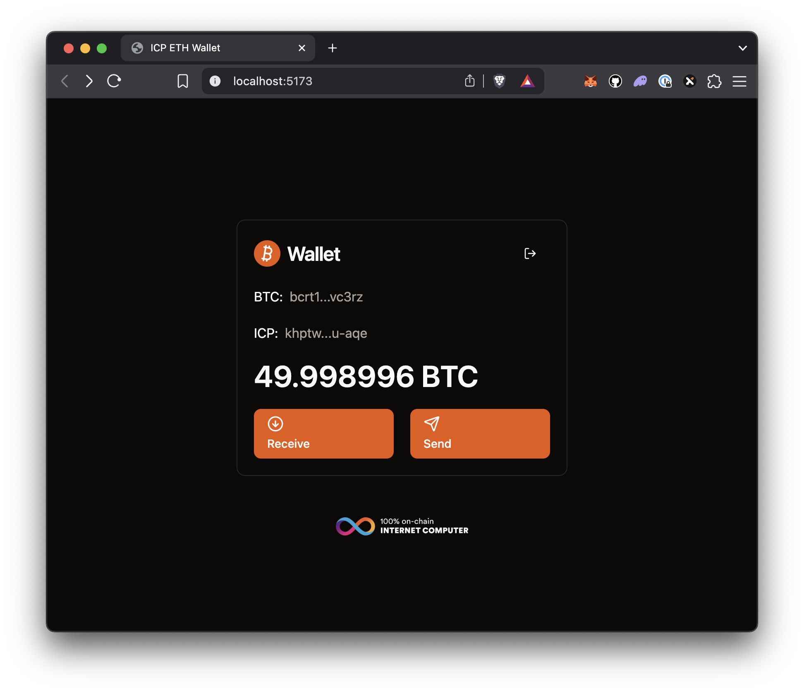

# A multiuser Bitcoin wallet built on the Internet Computer (ICP)

This multiuser Bitcoin wallet allows the user to generate a Bitcoin
address by logging in with their Internet Identity. The user can then send and receive Bitcoin to other users.

The backend canister uses the [ICP Bitcoin API](https://internetcomputer.org/docs/build-on-btc/) to interact with the Bitcoin blockchain.

The frontend is built with React and Vite.

[![Contributors][contributors-shield]][contributors-url]
[![Forks][forks-shield]][forks-url]
[![Stargazers][stars-shield]][stars-url]
[![Issues][issues-shield]][issues-url]
[![MIT License][license-shield]](LICENSE)


> [!TIP]
> Use this repository as a starting point for building your own multiuser Bitcoin wallet on the Internet Computer.
>
> Live demo: <https://unenw-dyaaa-aaaac-a3e6a-cai.icp0.io/>



## Project notes

At all times when interacting with canisters on the IC you should consider the
costs involved, and the fact that update calls take 2-3 seconds to complete. To
create a good user experience, this wallet uses a combination of local state and
canister calls to provide a responsive UI.

- The Bitcoin address is stored in local state after the user logs in. Next
  time the user logs in, the address is retrieved from local state.
- The balance of the Bitcoin address is queried from the backend canister that in
  turn queries the ICP Bitcoin API. A more efficient way to query the balance would be to call an external Bitcoin API directly from the frontend.

## Setup, pre-requisites

Setup your Internet Computer developer environment as well as a local Bitcoin testnet.

[https://internetcomputer.org/docs/build-on-btc/btc-dev-env](https://internetcomputer.org/docs/build-on-btc/btc-dev-env)

## Deploying the project

### 1. Start the Internet Computer with Bitcoin support enabled

```bash
dfx start --clean --enable-bitcoin --bitcoin-node 127.0.0.1:18444
```

### 2. Install dependencies

```
pnpm install
```

### 3. Deploy the canisters

```
dfx deploy
```

When asked to select a network, choose `regtest`.

> [!TIP]
> If you get an permissions error when deploying, you might need to set the execute
> bit on the build script.
>
> ```
> chmod +x build.sh
> ```

## Develop

During development, you can run the frontend with hot reloading using Vite.

```bash
pnpm run dev
```

## Before you start testing

> [!IMPORTANT]
> The Bitcoin "coinbase maturity rule" states that in order to spend newly created bitcoin, it has to be at least 100 blocks old.
>
> Before you create any transactions, mine at least 100 blocks and assign yourself the bitcoin rewards.
>
> ```
> bitcoin-cli -conf=$(pwd)/bitcoin.conf generatetoaddress 100 <address>
>```
>
> Also important, the local regtest network does not mine blocks automatically. You will need to mine blocks manually using the `bitcoin-cli` command after any transaction. Use the above command to mine blocks.

## Backend canister methods

### `get_address`

Get the Bitcoin address for the calling principal or for the principal
specified in the call parameters.

Call signature:

```
type AddressResult = variant { Ok : text; Err : text };

get_address : (owner: opt principal) -> (AddressResult);
```

Get the Bitcoin address for the calling principal:

```bash
dfx canister call backend get_address
```

Get the Bitcoin address for a specified principal:

```bash
dfx canister call backend get_address '(opt principal "hkroy-sm7vs-yyjs7-ekppe-qqnwx-hm4zf-n7ybs-titsi-k6e3k-ucuiu-uqe")'
```

### `get_balance`

Returns the bitcoin balance of the address controlled by a principal.

Call signature:

```
type BalanceResult = variant { Ok : nat64; Err : text };

get_balance : (owner: opt principal) -> (BalanceResult);
```

Get the ETH balance for the calling principal:

```bash
dfx canister call backend get_balance
```

Get the ETH balance for a specified principal:

```bash
dfx canister call backend get_balance '(opt principal "hkroy-sm7vs-yyjs7-ekppe-qqnwx-hm4zf-n7ybs-titsi-k6e3k-ucuiu-uqe")'
```

### `send_btc`

Sends ETH from the Bitcoin controlled by the calling principal to any
recipient.

Call signature:

```
type SendResult = variant { Ok : text; Err : text };

send_btc : (destination_address : BitcoinAddress, amount_in_satoshi : Satoshi) -> (SendResult);
```

Send ETH by specifying receiver address and ETH amount (in wei):

```bash
dfx canister call backend send_btc '("bcrt1pvd8yj03ts02lleztzf3em0glwrw7p03lumk4s6jv602ymzgc5jcqf2gsz8", 1000)'
```

## Contributors

<!-- readme: collaborators,contributors -start -->
<table>
	<tbody>
		<tr>
            <td align="center">
                <a href="https://github.com/kristoferlund">
                    
                    <br />
                    <sub><b>Kristofer</b></sub>
                </a>
            </td>
		</tr>
	<tbody>
</table>
<!-- readme: collaborators,contributors -end -->

## License

This project is licensed under the MIT License. See the LICENSE file for more
details.

## Contributing

Contributions are welcome! Please open an issue or submit a pull request if you
have any suggestions or improvements.

[contributors-shield]: https://img.shields.io/github/contributors/kristoferlund/bitcoin_wallet.svg?style=for-the-badge
[contributors-url]: https://github.com/kristoferlund/bitcoin_wallet/graphs/contributors
[forks-shield]: https://img.shields.io/github/forks/kristoferlund/bitcoin_wallet.svg?style=for-the-badge
[forks-url]: https://github.com/kristoferlund/bitcoin_wallet/network/members
[stars-shield]: https://img.shields.io/github/stars/kristoferlund/bitcoin_wallet?style=for-the-badge
[stars-url]: https://github.com/kristoferlund/bitcoin_wallet/stargazers
[issues-shield]: https://img.shields.io/github/issues/kristoferlund/bitcoin_wallet.svg?style=for-the-badge
[issues-url]: https://github.com/kristoferlund/bitcoin_wallet/issues
[license-shield]: https://img.shields.io/github/license/kristoferlund/bitcoin_wallet.svg?style=for-the-badge
[license-url]: https://github.com/kristoferlund/bitcoin_wallet/blob/master/LICENSE.txt
